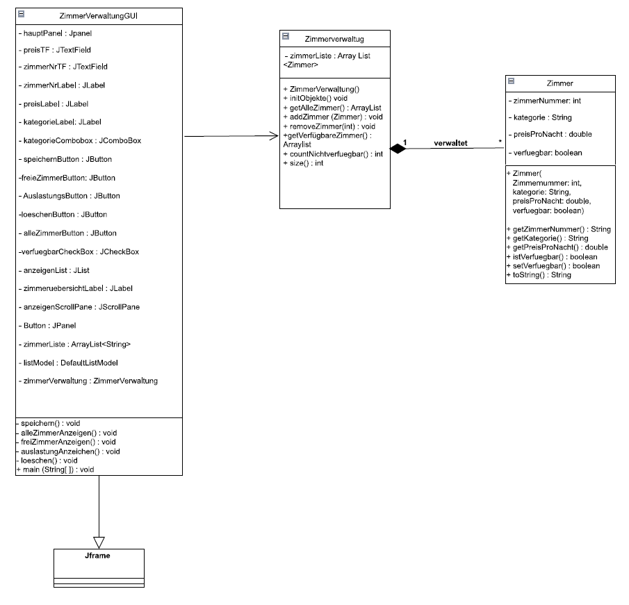

# Zimmerverwaltung – OOP Projekt

## Projektbeschreibung

Dieses Projekt ist eine Zimmerverwaltung für ein Hotel, die im Rahmen einer Projektarbeit
in Java entwickelt wurde.  
Die Anwendung dient der internen Verwaltung von Hotelzimmern und ist keine Buchungsverwaltung.

Hotelmitarbeiter können Zimmer anlegen, anzeigen, filtern und löschen sowie Informationen zur Auslastung abrufen.

Das Projekt wurde objektorientiert umgesetzt und nutzt eine grafische Benutzeroberfläche.

---

## Funktionen

Die Anwendung bietet folgende Funktionen:

- Anlegen neuer Zimmer mit:
    - Zimmernummer
    - Kategorie
    - Preis pro Nacht
    - Verfügbarkeitsstatus
- Anzeige aller Zimmer
- Anzeige nur verfügbarer Zimmer
- Löschen eines ausgewählten Zimmers
- Berechnung der Anzahl nicht verfügbarer Zimmer
- Fehlerbehandlung bei ungültigen Eingaben (Exceptions)
- Automatisierte Tests der Controllerklasse mittels JUnit

---

## Projektstruktur

Das Projekt besteht aus drei zentralen Klassen, die einer MVC-ähnlichen Struktur folgen:

### 1. Zimmer (Model)
Die Klasse `Zimmer` repräsentiert ein einzelnes Hotelzimmer.
Sie enthält die Attribute eines Zimmers sowie Methoden zum Abfragen und Ändern
des Verfügbarkeitsstatus.

### 2. ZimmerVerwaltung (Controller)
Die Klasse `ZimmerVerwaltung` verwaltet mehrere `Zimmer`-Objekte.
Sie fungiert als Controllerklasse und enthält die fachlichen Regeln zur Verwaltung der Zimmer wie z.B.

- Hinzufügen und Entfernen von Zimmern
- Prüfung auf doppelte Zimmernummern
- Ermitteln verfügbarer Zimmer
- Zählen nicht verfügbarer Zimmer

Diese Klasse wird unabhängig von der GUI mit JUnit getestet.

### 3. ZimmerVerwaltungGUI (View)
Die Klasse `ZimmerVerwaltungGUI` stellt die grafische Benutzeroberfläche dar.
Sie ermöglicht die Benutzereingabe und Anzeige der Daten und greift für alle
Operationen auf die Klasse `ZimmerVerwaltung` zu.

---

## UML-Diagramm

Zur Planung und Erklärung der Objektstruktur wurde ein UML-Klassendiagramm verwendet.
Es zeigt die Klassen `Zimmer`, `ZimmerVerwaltung` und `ZimmerVerwaltungGUI` sowie deren
Beziehungen zueinander.

---

## Nutzung der Anwendung

1. Führen sie die GUI-Klasse `ZimmerVerwaltungGUI` aus.
2. Geben Sie eine Zimmernummer, einen Preis und eine Kategorie ein.
3. Legen Sie über die Checkbox fest, ob das Zimmer verfügbar ist.
4. Klicken Sie auf Speichern, um ein neues Zimmer anzulegen.
5. Nutzen Sie die Buttons, um:
    - alle Zimmer anzuzeigen
    - nur verfügbare Zimmer anzuzeigen
    - ein ausgewähltes Zimmer zu löschen
6. Bei ungültigen Eingaben werden entsprechende Fehlermeldungen angezeigt.

---

## Tests

Die Klasse `ZimmerVerwaltung` wird mit JUnit getestet.
Dabei werden unter anderem folgende Aspekte überprüft:

- Hinzufügen von Zimmern
- Löschen von Zimmern
- Ermittlung verfügbarer Zimmer
- Zählen nicht verfügbarer Zimmer

Die Tests stellen sicher, dass die Controllerlogik unabhängig von der grafischen Benutzeroberfläche korrekt funktioniert.

---

 
(Erstellt von Luis Schmidt und Michael Becker)

